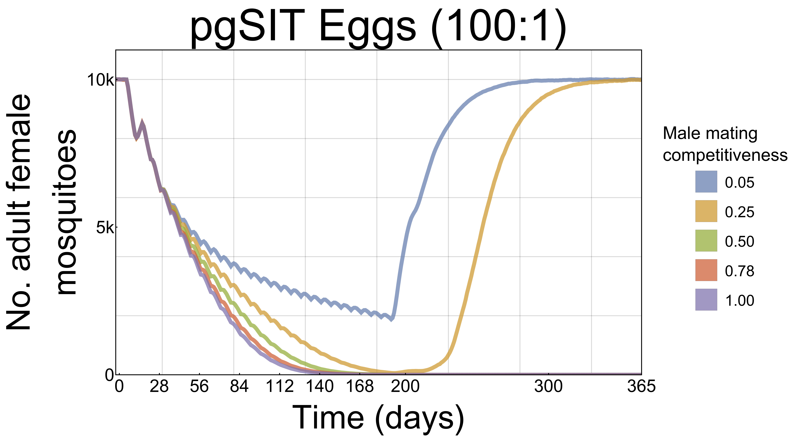

# Datasets for: Transforming Insect Population Control with Precision Guided Sterile Males.

## Interventions Contrast

These datasets hold the results of the experiments to perform the comparisons between the different mosquito-control interventions.

_Note: each scenario was repeated 2000 times_

### Datasets01.7z

* Releases Scheme:
	* Rate: 1 release every 7 days
	* Total: 26
* Drive Specific Parameters:
	* IIT (10:1)
		* Adult Lifespan Reduction: 50%
	* RIDL (10:1)
		* Mating Efficacy: 5%
		* Adult Lifespan Reduction: 18%
		* Male Pupation Success Rate: 0%
		* Female Pupation Success Rate: 0%
	* fsRIDL (Eggs 200:1)
		* Mating Efficacy: 5%
		* Adult Lifespan Reduction: 18%
		* Male Pupation Success Rate: 100%
		* Female Pupation Success Rate: 0%
	* CRISPR SIT (Eggs 100:1)
		* Mating Efficacy: 78%
		* Adult Lifespan Reduction: 18%
		* Male Pupation Success Rate: 100%
		* Female Pupation Success Rate: 0%

### Datasets02.7z

* Releases Scheme:
	* Rate: 1 release every 7 days
	* Total: 26
* Drive Specific Parameters:
	* IIT (10:1)
		* Adult Lifespan Reduction: 50%
	* RIDL (10:1)
		* Mating Efficacy: 5%
		* Adult Lifespan Reduction: 18%
		* Male Pupation Success Rate: 0%
		* Female Pupation Success Rate: 0%
	* fsRIDL (Eggs 200:1)
		* Mating Efficacy: 5%
		* Adult Lifespan Reduction: 18%
		* Male Pupation Success Rate: 100%
		* Female Pupation Success Rate: 0%
	* CRISPR SIT (Eggs 200:1)
		* Mating Efficacy: 78%
		* Adult Lifespan Reduction: 18%
		* Male Pupation Success Rate: 100%
		* Female Pupation Success Rate: 0%

## Parameters Sweeps

Sensitivity analysis on important parameters for the pgSIT drive.

_Note: each scenario was repeated 20 times_

### Lifespan Reduction

Sweeping the lifespan reduction effects (mortality) on the genetically modified individuals.

* _LifespanReduction01.7z_: female eggs allowed at a .5 ratio, and they die on pupation (100:1)
* _LifespanReduction02.7z_: female eggs allowed at a .5 ratio, and they die on pupation (200:1)

### Mating Efficacy

Sweeping the mating efficacy on the genetically modified individuals.

* _MatingEfficacy01.7z_: female eggs allowed at a .5 ratio, and they die on pupation (100:1)
* _MatingEfficacy02.7z_: female eggs allowed at a .5 ratio, and they die on pupation (200:1)

### LifespanAndMatingFactorial

Factorial sweep of both effects.

* _Factorial01.7z_: female eggs allowed at a .5 ratio, and they die on pupation (100:1)
* _Factorial02.7z_: female eggs allowed at a .5 ratio, and they die on pupation (200:1)

# Associated Publications

(In Work) Transforming Insect Population Control with Precision Guided Sterile Males.
Nikolay Kandul, Junru Liu, Hector M. Sanchez C., Sean L. Wu, John M. Marshall and Omar S. Akbari
